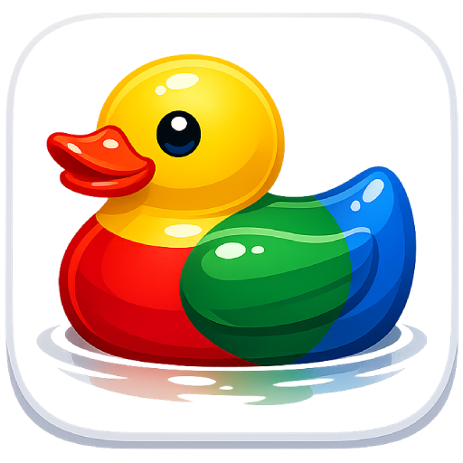
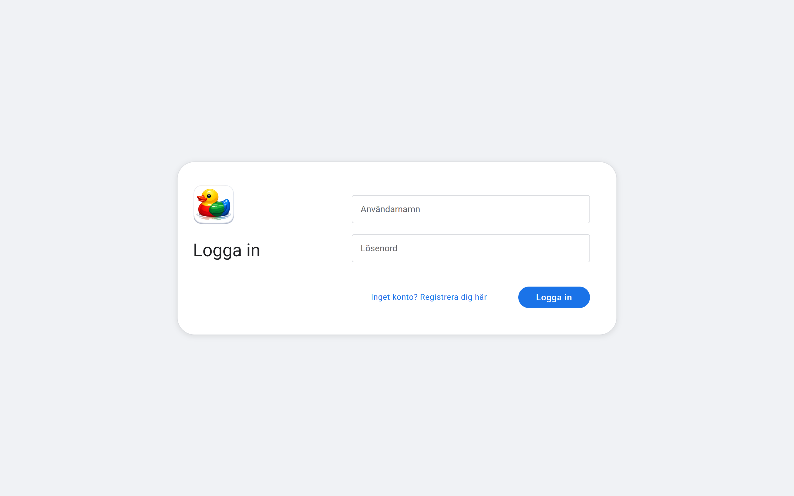
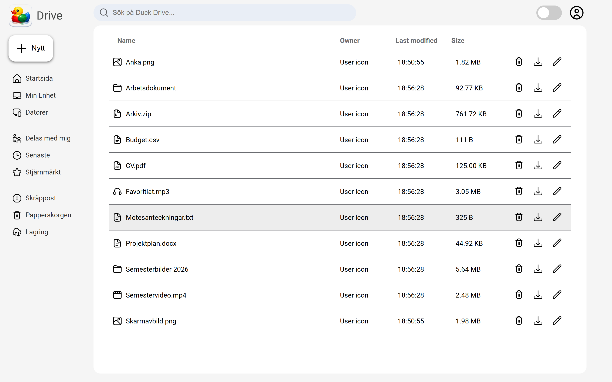
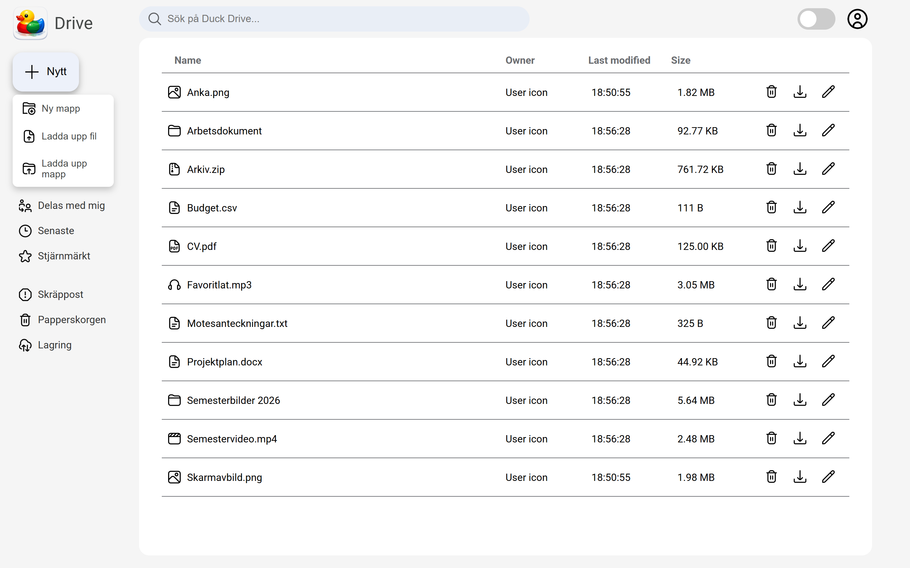
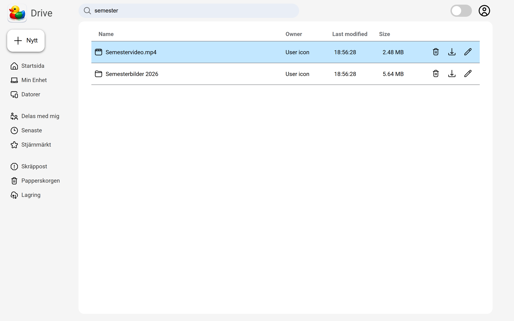
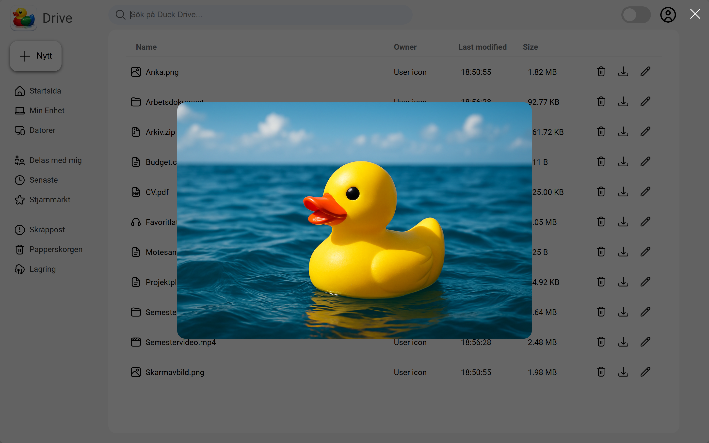
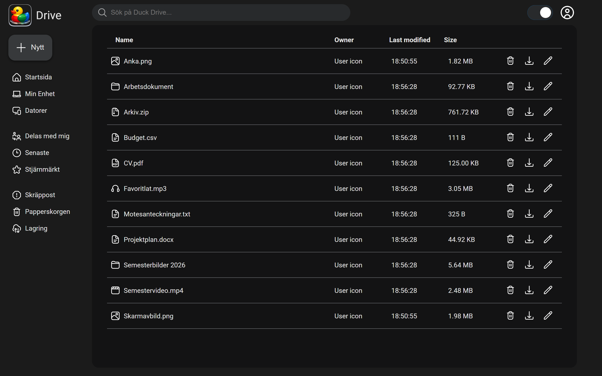

<div align="center">



# Duck Drive

**En molnbaserad fillagringstjänst – byggd från grunden med Vue 3 och Node.js**


</div>

---

##  Om projektet

**Duck Drive** är en komplett fullstack-webbapplikation för fillagring i molnet – tänk *Google Drive*, fast egenutvecklad från grunden. Användaren skapar ett konto, loggar in säkert och kan sedan **ladda upp, organisera, förhandsgranska och ladda ner** sina filer och mappar – allt direkt i webbläsaren.

Varje användare får ett eget, privat lagringsutrymme som är isolerat från alla andra konton. Gränssnittet är byggt för att kännas snabbt, modernt och igenkännbart, med stöd för både **drag & drop**, **mörkt/ljust tema** och **responsiv design** för mobil och dator.

Projektet visar hela kedjan i en modern webbtjänst – från ett komponentbaserat frontend i **Vue 3** till ett REST-API i **Express** med säker autentisering, filhantering och sessionshantering.

---

##  Funktioner

| Funktion | Beskrivning |
|---|---|
| **Säker inloggning** | Registrering och inloggning med lösenord som hashas med **bcrypt**. Sessionshantering med skyddade API-routes. |
| **Uppladdning** | Ladda upp filer och hela mappar – via knapp eller **drag & drop** direkt i webbläsaren. |
| **Mappar & navigering** | Skapa mappar, navigera in och ut ur dem och organisera ditt innehåll fritt. |
| **Förhandsgranskning** | Visa **bilder, video, ljud, PDF och textfiler** direkt i appen utan att ladda ner dem. |
| **Nedladdning** | Ladda ner enskilda filer – eller hela mappar paketerade som **.zip**. |
| **Byt namn & radera** | Hantera dina filer och mappar med några klick. |
| **Smart sökning** | Snabb sökning med **fuzzy-matchning** som hittar filer även vid felstavning. |
| **Mörkt & ljust tema** | Växla tema med ett klick – inställningen sparas mellan besök. |
| **Responsiv design** | Fungerar lika bra på mobil som på dator, med anpassad meny. |

---

##  Skärmdumpar

### Inloggning & registrering
Ren och välkomnande inloggningssida. Användaren kan smidigt växla mellan att logga in och skapa ett nytt konto.



### Översikt – mina filer
Tydlig översikt över alla filer och mappar med namn, ägare, ändringsdatum, storlek och snabbåtgärder. Varje filtyp får sin egen ikon.



### Skapa nytt & ladda upp
Med ett klick på **Nytt** kan användaren skapa en mapp eller ladda upp filer och mappar.



### Sökning med fuzzy-matchning
Sökfältet filtrerar listan direkt medan man skriver och rankar de mest relevanta träffarna högst.



### Förhandsgranskning i webbläsaren
Bilder, video, ljud, PDF och text kan öppnas och visas direkt i appen.



### Mörkt tema
Hela gränssnittet stödjer ett genomtänkt mörkt tema.



---

##  Teknik

**Frontend**
- [Vue 3](https://vuejs.org/) (Composition API, `<script setup>`)
- [Vite](https://vitejs.dev/) – byggverktyg och dev-server
- [VueUse](https://vueuse.org/) – komposabler för t.ex. tema och klick-utanför
- [fuzzysort](https://github.com/farzher/fuzzysort) – fuzzy-sökning

**Backend**
- [Node.js](https://nodejs.org/) + [Express](https://expressjs.com/) – REST-API
- [Multer](https://github.com/expressjs/multer) – filuppladdning
- [bcrypt](https://github.com/kelektiv/node.bcrypt.js) – hashning av lösenord
- [express-session](https://github.com/expressjs/session) – sessionshantering
- [archiver](https://github.com/archiverjs/node-archiver) – paketering av mappar till .zip

---

##  Säkerhet & arkitektur

Några av de tekniska beslut som gör appen robust:

- **Lösenord lagras aldrig i klartext** – de hashas med bcrypt innan de sparas.
- **Skydd mot path traversal** – alla filsökvägar valideras så att en användare aldrig kan nå filer utanför sin egen mapp.
- **Auth-middleware** skyddar alla känsliga API-routes; utan giltig session nekas åtkomst.
- **Filisolering per användare** – varje konto har en egen, separat lagringsmapp.

---

##  Kom igång

> Kräver [Node.js](https://nodejs.org/) (v20.19+ eller v22.12+).

```bash
# Gå till projektmappen
cd "Duck Drive"

# Installera beroenden
npm install

# Bygg frontend
npm run build

# Starta servern (http://localhost:80)
npm start
```

Öppna sedan **http://localhost:80** i webbläsaren, skapa ett konto och börja ladda upp filer.

**Utvecklingsläge** (med hot reload) körs istället med två processer:

```bash
npm run dev     # Frontend (Vite) på http://localhost:5173
npm start       # Backend (Express) på http://localhost:80
```

---

<div align="center">

*Byggt med Vue.*

</div>
